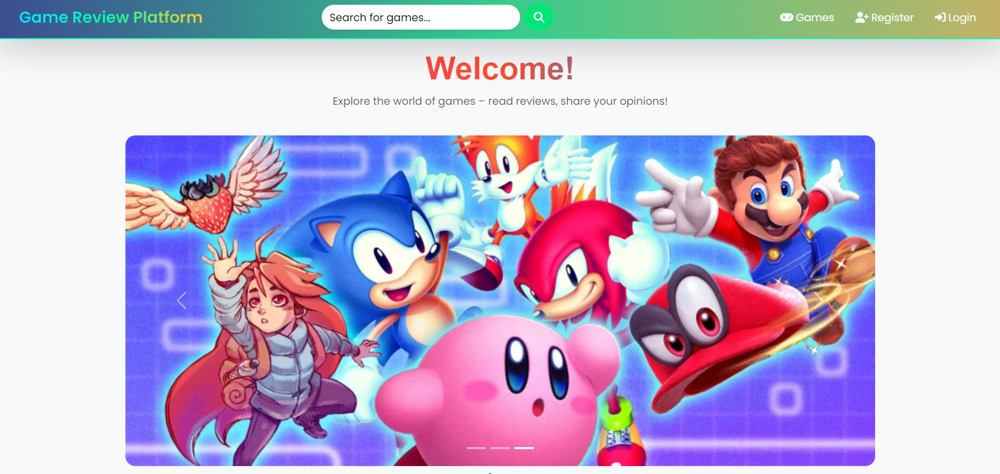
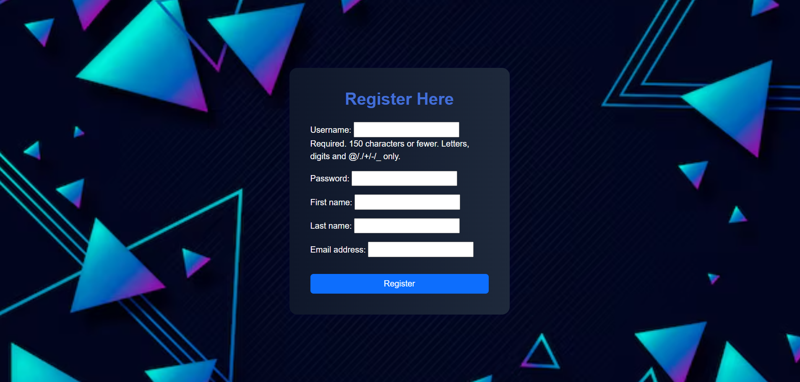
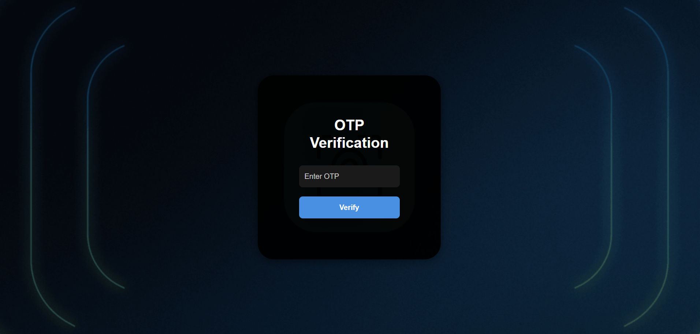

# 🎮 Game Review Platform
A comprehensive Game Review Platform built with Django, designed for gamers and enthusiasts to explore, review, and rate games. This platform features secure user registration with email-based OTP verification, and a rating system. Review submissions are authenticated to ensure quality, and the platform is equipped with a clean, modern, and fully responsive user interface for an optimal browsing experience across devices.

---

## 🚀 Features

- 📝 User Registration & Login with OTP email verification    
- 🌟 Rating system  
- 💬 Add, Edit, and Delete reviews  
- 🔍 Search and Filter games  
- 🖼️ Game detail page   
- 🎨 Professional responsive UI (Home, Navbar, Footer)  
- 🔐 Auth-based access control  
- 📈 Admin Panel for managing games and users  

---

## 🛠️ Tech Stack

**Frontend:**
- HTML, CSS, Bootstrap
- JavaScript (Optional enhancements)

**Backend:**
- Python 3.x
- Django 4.x

**Database:**
- SQLite (for development)

**Others:**

- SMTP for OTP Email Verification
- Git & GitHub for version control

---

## ⚙️ Setup Instructions

Follow these steps to run the project locally:

1. **Clone the repository:**
   ```bash
   git clone https://github.com/gitannap/Game_Review_Platform.git
   cd Game_Review_Platform

2. **Create virtual environment:**
   ```bash
   python -m venv venv

3. **Activate the virtual environment:**
   ```bash
   Windows: venv\Scripts\activate
   macOS/Linux: source venv/bin/activate

4. **Install dependencies:**
   ```bash
   pip install -r requirements.txt

5. **Configure your .env or settings.py:**
   ```bash
   Set up your email backend for OTP verification.
   Configure database settings if not using SQLite.

6. **Apply migrations:**
   ```bash
   python manage.py makemigrations
   python manage.py migrate

7. **Create superuser:**
   ```bash
   python manage.py createsuperuser

8. **Run the server:**
   ```bash
   python manage.py runserver

9. **Access the platform:**
   ```bash
   Visit http://127.0.0.1:8000/ in the browser.

---

## 📸 Screenshots

Here are a few screenshots to give you a visual overview of the application:

### Home Page


### Registration Page


### OTP After Registration Page


### Login Page


### Search Page


### Game Page


### Game Detail Page


### Add Review Page


---

## 👩‍💻 Author

Developed by **Anna Seby**

---

## 📬 Contact

For queries or collaboration:

Anna Seby

📧 annaseby5213@gmail.com

🔗 LinkedIn: https://www.linkedin.com/in/anna-seby

🔗 GitHub: https://github.com/gitannap

---

## 📃 License

This project is licensed under the MIT License.

You are free to use, and distribute this software for any purpose, provided that the original copyright.

© Anna Seby

---


---


